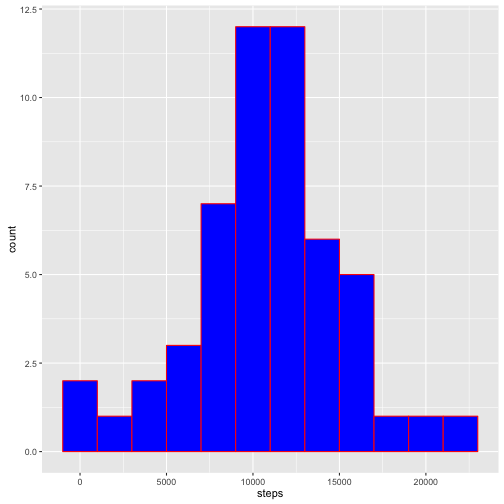
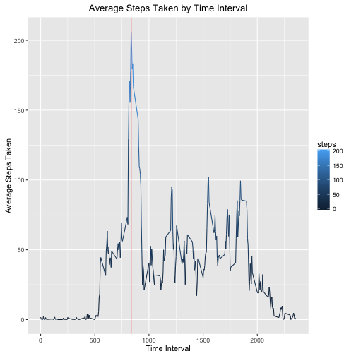
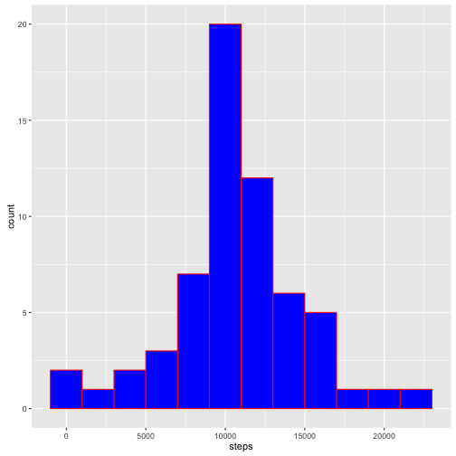
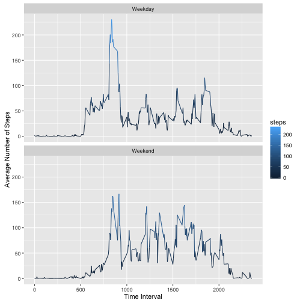

#                  Activity Monotoring Data Analysis
================================================================================

### Loading Data

Requires plyr, chron and ggplot2 packages


```r
    library(plyr)
    library(ggplot2)
    library(chron)
```

Assume data is stored in activity.csv file in the working directory.


```r
    activity<-read.csv("activity.csv")
```

### What is mean total number of steps taken per day?

Ignore the missing values in the dataset.

1. Calculate the total number of steps taken per day.


```r
    steptotal<-aggregate(steps ~ date, activity, sum,na.rm=TRUE)
    print(steptotal)
```

```
##          date steps
## 1  2012-10-02   126
## 2  2012-10-03 11352
## 3  2012-10-04 12116
## 4  2012-10-05 13294
## 5  2012-10-06 15420
## 6  2012-10-07 11015
## 7  2012-10-09 12811
## 8  2012-10-10  9900
## 9  2012-10-11 10304
## 10 2012-10-12 17382
## 11 2012-10-13 12426
## 12 2012-10-14 15098
## 13 2012-10-15 10139
## 14 2012-10-16 15084
## 15 2012-10-17 13452
## 16 2012-10-18 10056
## 17 2012-10-19 11829
## 18 2012-10-20 10395
## 19 2012-10-21  8821
## 20 2012-10-22 13460
## 21 2012-10-23  8918
## 22 2012-10-24  8355
## 23 2012-10-25  2492
## 24 2012-10-26  6778
## 25 2012-10-27 10119
## 26 2012-10-28 11458
## 27 2012-10-29  5018
## 28 2012-10-30  9819
## 29 2012-10-31 15414
## 30 2012-11-02 10600
## 31 2012-11-03 10571
## 32 2012-11-05 10439
## 33 2012-11-06  8334
## 34 2012-11-07 12883
## 35 2012-11-08  3219
## 36 2012-11-11 12608
## 37 2012-11-12 10765
## 38 2012-11-13  7336
## 39 2012-11-15    41
## 40 2012-11-16  5441
## 41 2012-11-17 14339
## 42 2012-11-18 15110
## 43 2012-11-19  8841
## 44 2012-11-20  4472
## 45 2012-11-21 12787
## 46 2012-11-22 20427
## 47 2012-11-23 21194
## 48 2012-11-24 14478
## 49 2012-11-25 11834
## 50 2012-11-26 11162
## 51 2012-11-27 13646
## 52 2012-11-28 10183
## 53 2012-11-29  7047
```

2. Make a histogram of the total number of steps taken each day


```r
    ggplot(data=steptotal, aes(x=steps)) + geom_histogram(color="red",fill="blue",binwidth = 2000) 
```



3. Calculate and report the mean and median of the total number of steps taken per day


```r
    summ<-summary(steptotal$steps)
    print(summ)
```

```
##    Min. 1st Qu.  Median    Mean 3rd Qu.    Max. 
##      41    8841   10760   10770   13290   21190
```

### What is the average daily activity pattern?

1. Make a time series plot of the 5-minute interval (x-axis) and the average number of  
   steps taken, averaged across all days (y-axis)
   

```r
    stepmeanbyinterval<-aggregate(steps ~ interval, activity, mean,na.rm=TRUE)
    maxtimeinterval<-stepmeanbyinterval[which.max(stepmeanbyinterval$steps),1]
    plt<-ggplot(data=stepmeanbyinterval, aes(x=interval, y=steps))  
    plt<-plt+geom_line(aes(group=1, col=steps))
    plt<-plt+ggtitle(expression('Average Steps Taken by Time Interval')) 
    plt<-plt+ylab('Average Steps Taken') + xlab('Time Interval') 
    plt<-plt+geom_vline(xintercept = maxtimeinterval, color="red")
    print(plt)
```



2. Which 5-minute interval, on average across all the days in the dataset, contains the maximum number of steps?


```r
   maxtimeinterval<-stepmeanbyinterval[which.max(stepmeanbyinterval$steps),1]
   print(maxtimeinterval)
```

```
## [1] 835
```

### Imputing missing values

1. Calculate and report the total number of missing values in the dataset


```r
    nas<-activity[is.na(activity$steps),]
    nascount<-dim(nas)[1]
    print(nascount)
```

```
## [1] 2304
```

2. Since not all days have step values, i decided to replace NAs with average at the time interval.


```r
   for(i in seq(nas$interval))
   {
        nas$steps[[i]]=
            stepmeanbyinterval$steps[[which(stepmeanbyinterval$interval==nas$interval[[i]])]]
   }
```

3. Create a new dataset that is equal to the original dataset but with the missing data filled in.


```r
    #create new data set with imputed values and with measured values
    nonas<-activity[!is.na(activity$steps),]
    newdata<-rbind(nonas,nas)
    
    #sort new data set by date and interval to match with orginal
    newdata<-arrange(newdata,date,interval)
```

4. Make a histogram of the total number of steps taken each day.


```r
    #sum up total steps each day
    steptotal2<-aggregate(steps ~ date, newdata, sum)
    print(steptotal2)
```

```
##          date    steps
## 1  2012-10-01 10766.19
## 2  2012-10-02   126.00
## 3  2012-10-03 11352.00
## 4  2012-10-04 12116.00
## 5  2012-10-05 13294.00
## 6  2012-10-06 15420.00
## 7  2012-10-07 11015.00
## 8  2012-10-08 10766.19
## 9  2012-10-09 12811.00
## 10 2012-10-10  9900.00
## 11 2012-10-11 10304.00
## 12 2012-10-12 17382.00
## 13 2012-10-13 12426.00
## 14 2012-10-14 15098.00
## 15 2012-10-15 10139.00
## 16 2012-10-16 15084.00
## 17 2012-10-17 13452.00
## 18 2012-10-18 10056.00
## 19 2012-10-19 11829.00
## 20 2012-10-20 10395.00
## 21 2012-10-21  8821.00
## 22 2012-10-22 13460.00
## 23 2012-10-23  8918.00
## 24 2012-10-24  8355.00
## 25 2012-10-25  2492.00
## 26 2012-10-26  6778.00
## 27 2012-10-27 10119.00
## 28 2012-10-28 11458.00
## 29 2012-10-29  5018.00
## 30 2012-10-30  9819.00
## 31 2012-10-31 15414.00
## 32 2012-11-01 10766.19
## 33 2012-11-02 10600.00
## 34 2012-11-03 10571.00
## 35 2012-11-04 10766.19
## 36 2012-11-05 10439.00
## 37 2012-11-06  8334.00
## 38 2012-11-07 12883.00
## 39 2012-11-08  3219.00
## 40 2012-11-09 10766.19
## 41 2012-11-10 10766.19
## 42 2012-11-11 12608.00
## 43 2012-11-12 10765.00
## 44 2012-11-13  7336.00
## 45 2012-11-14 10766.19
## 46 2012-11-15    41.00
## 47 2012-11-16  5441.00
## 48 2012-11-17 14339.00
## 49 2012-11-18 15110.00
## 50 2012-11-19  8841.00
## 51 2012-11-20  4472.00
## 52 2012-11-21 12787.00
## 53 2012-11-22 20427.00
## 54 2012-11-23 21194.00
## 55 2012-11-24 14478.00
## 56 2012-11-25 11834.00
## 57 2012-11-26 11162.00
## 58 2012-11-27 13646.00
## 59 2012-11-28 10183.00
## 60 2012-11-29  7047.00
## 61 2012-11-30 10766.19
```


```r
    #plot histogram of total steps 
    ggplot(data=steptotal2, aes(x=steps)) + geom_histogram(color="red",fill="blue",binwidth = 2000)
```



5. Calculate and report the mean and median total number of steps taken per day.


```r
    #summarize
    summ2<-summary(steptotal2$steps)
    print(summ2)
```

```
##    Min. 1st Qu.  Median    Mean 3rd Qu.    Max. 
##      41    9819   10770   10770   12810   21190
```

Do these values differ from the estimates from the first part of the assignment? 
What is the impact of imputing missing data on the estimates of the total daily number of steps?

Mean stayed same while median moved one notch up. But total number of steps taken per day increased when there are NAs.

### Are there differences in activity patterns between weekdays and weekends?

1. Create a new factor variable in the dataset with two levels weekday and weekend indicating whether
a given date is a weekday or weekend day.


```r
    newdata$daytype<-sapply(newdata$date,function(x) {if(is.weekend(x)) "Weekend" else "Weekday"})
```

2. Make a panel plot containing a time series plot of the 5-minute interval (x-axis) and the average number of steps taken, averaged across all weekday days or weekend days (y-axis).


```r
    #find mean steps by time interval 
    stepmeanbyinterval2<-aggregate(steps ~ interval+daytype, newdata, mean)

    plt2<-ggplot(data=stepmeanbyinterval2,aes(x=stepmeanbyinterval2$interval,y=stepmeanbyinterval2$steps))
    plt2<-plt2+geom_line(aes(group=1, col=steps)) 
    plt2<-plt2+facet_wrap(~daytype,nrow = 2,ncol = 1) 
    plt2<-plt2+labs(x="Time Interval",y="Average Number of Steps")
    print(plt2)
```



